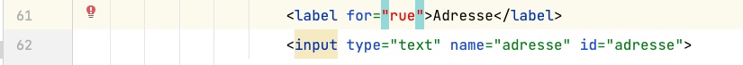

# Grille d'évaluation pour le TP3
## Structure, sémantique, accessibilité, API des formulaires HTML5
- [X] __Regrouper les éléments de formulaire de même nature__ (1 point)  
  - Utiliser des `<fieldsets>`  
  - Faire des groupes d’`<option>`s dans une liste déroulante
- [X] __Étiqueter__ (0.75/1 point)  
  - Étiqueter les groupes d’éléments de formulaire   
  - Nommer chaque groupe avec une `<legend>`  
  - Étiqueter un groupe d’`<option>`s d’une liste déroulante  
  - Étiqueter avec un `<label>` les champs de formulaire  
- [X] __Tester l'accessibilité__ (.85/1 point)  
  - Rendre (garder) le formulaire navigable au clavier  
  - Baliser avec précision les éléments de formulaire  
  - Bien choisir le type du `<input>`   
  - Code sémantique et valide pour l’ensemble du document  
- [X] __Ajouter des containtes de saisie__ (.75/1 point)  
  - Identifier par un attribut approprié les champs obligatoires du formulaire  
  - Ajouter des contraintes de saisie sur les champs de formulaire  

## Styles CSS
- [X] __Aligner les éléments de formulaire__ (.85/1 point)
    - Contrôler les espacements 
- [X] __Intégrer tous les contenus__  (.9/1 point)  
  - Selon les guides visuels (ou mieux !)
- [X] __Styler l’interactivité__  (0.75/1 point)
  - État focus, état checked des éléments de formulaires  
  - États des hyperliens (link, visited, hover, active)  
  - Styler les messages d’erreur
  - Utiliser des sprites CSS  
- [X] __Styler les boutons radio__  (.85/1 point) 
  - en les gardant accessibles au clavier

## Méthodes de travail favorisant la collaboration
- [X] __Organiser et documenter la feuille de styles__  (.75/1 point)
- [X] __Utiliser le contrôle des versions GIT__  (1 point)
    - Un minimum de 3 commits est attendu pour les étapes html, css, contrôle qualité finale

## Commentaires
 7.75/10 

- Bon travail d'intégration, mais ça pourrait être encore mieux ;)

### HTML
- Quelques [erreurs](images/erreurs-html-ap.png)
  - quelques étiquettes mal attachées : celles de l'"adresse" et celle de "pays/province"
  
  - il manquait la fermeture `</fieldset>` du groupe d'éléments de formulaire du *Coupon de participation*

### Fonctionnalités - contraintes de saisie
- Il manque un attribut `required` sur l'adresse
- Pour le numéro de téléphone les contraintes sont bien choisies, `type="tel"` et `maxlength` mais il est tout de même possible de valider des lettres plutôt que des chiffres. Un `pattern` serait plus efficace.
- Les boutons radio ne forme pas un groupe mutuellement exclusif car la valeur de leur attribut `name` n'est pas identique pour les 3. 
Voir corrections dans le code du commit de l'évaluation: `name="monument"`

### CSS
- Jour / Mois / Année devraient être sur une seule ligne
- Les sprites css n'étaient pas utilisés pour afficher les icônes des messages de validation.
Les règles CSS utiles ont été ajoutées à la fin du fichier utilitaires.css`

## Barème
| Barème | sur 1 |
|--------|-------|
| A+     | 1     |
| A      | 0.95  |
| B+     | 0.9   |
| B      | 0.85  |
| C+     | 0.8   |
| C      | 0.75  |
| D      | 0.65  |
